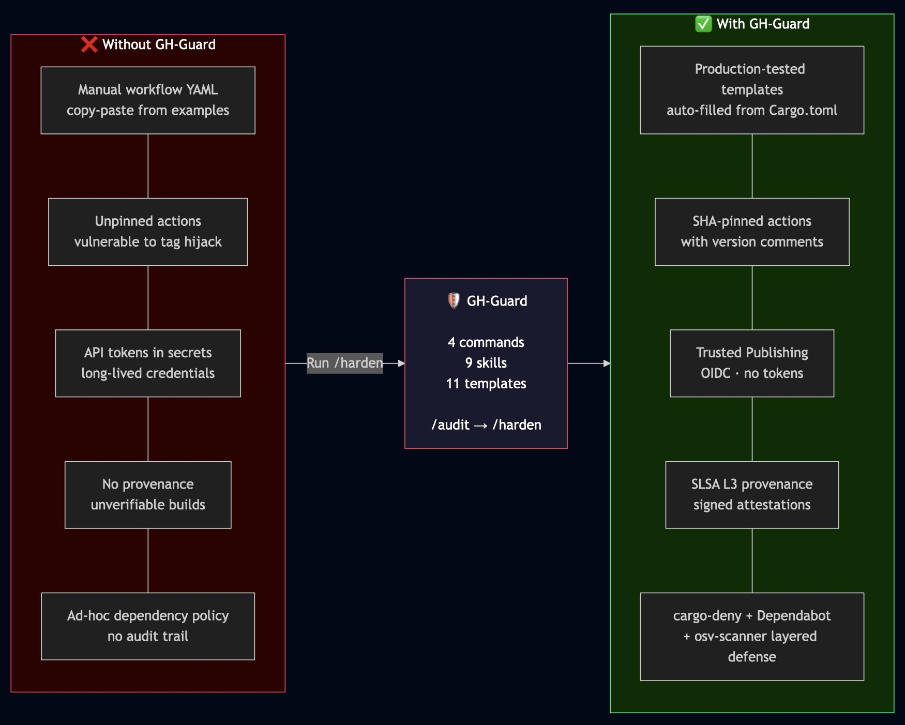

# GH-Guard

<p align="center">
  
</p>

CI/CD supply chain hardening plugin for [Claude Code](https://claude.com/claude-code), designed for Rust projects.

GH-Guard packages production-tested CI/CD security configurations into reusable templates and guided workflows. It helps Rust OSS maintainers achieve high [OpenSSF Scorecard](https://scorecard.dev) scores, set up [Trusted Publishing](https://blog.rust-lang.org/2023/11/09/crates-io-trusted-publishing.html), generate [SLSA L3](https://slsa.dev) provenance, and configure comprehensive dependency auditing.

## Installation

**From the Claude Code plugin registry:**

```
/plugin install gh-guard
```

**Or manually** — add to your Claude Code settings (`~/.claude/settings.json`):

```json
{
  "plugins": [
    "~/path/to/gh-guard"
  ]
}
```

## Quick Start

```
# Audit your project's supply chain security posture
/audit

# Interactively harden your project
/harden

# Generate a specific config file
/generate ci-workflow
/generate publish-workflow
/generate deny-toml

# Check for outdated SHA pins
/check-updates

# Validate generated configs
/verify
```

## Commands

### `/audit` — Gap Analysis

Scans your repository and produces a structured gap analysis:
- Checks for expected files (workflows, deny.toml, SECURITY.md, etc.)
- Scores against OpenSSF Scorecard checks
- Classifies your current hardening level (Minimal / Standard / Hardened)
- Identifies SHA-pinning gaps, missing permissions, Cargo.lock issues
- Flags dangerous workflow patterns (`pull_request_target`, `workflow_run` with untrusted input, script injection via PR title/body)
- Detects workspace projects and validates publish ordering
- Outputs prioritized recommendations with template references

### `/harden` — Interactive Wizard

Guides you through hardening at three levels:

| Level | Components |
|-------|-----------|
| **Minimal** | CI workflow + cargo-deny + Dependabot + SECURITY.md |
| **Standard** | + Trusted Publishing + CodeQL + Scorecard + release script |
| **Hardened** | + SLSA L3 provenance + fuzz testing + osv-scanner |

Detects your current hardening level and offers upgrade mode — generating only the delta files needed to reach the next level. Supports workspace projects with per-crate Trusted Publishing guidance.

### `/check-updates` — SHA Pin Checker

Checks deployed workflows for outdated action SHAs and CLI tool versions:
- Compares pinned SHAs against latest tags via the GitHub API
- Detects outdated CLI tool versions (cargo-audit, cargo-fuzz)
- Shows what's out of date with current vs latest comparison
- Offers to apply updates automatically
- Respects the SLSA generator exception (must use `@tag`, not SHA)

### `/verify` — Post-Generation Validation

Validates that generated configs are syntactically correct, internally consistent, and ready to deploy:
- YAML/TOML syntax validation
- SHA pin completeness and version comment presence
- Cross-file consistency (MSRV, gate job, fuzz targets)
- `cargo-deny check` dry run (if installed)
- `release.sh --dry-run` validation

### `/generate <target>` — File Generator

Generates a single file with auto-detected project values. Shows a unified diff before overwriting existing files.

| Target | Output Path |
|--------|------------|
| `ci-workflow` | `.github/workflows/ci.yml` |
| `publish-workflow` | `.github/workflows/publish.yml` |
| `codeql` | `.github/workflows/codeql.yml` |
| `scorecard` | `.github/workflows/scorecard.yml` |
| `fuzz` | `.github/workflows/fuzz.yml` |
| `deny-toml` | `deny.toml` |
| `rust-toolchain` | `rust-toolchain.toml` |
| `dependabot` | `.github/dependabot.yml` |
| `security-md` | `SECURITY.md` |
| `release-script` | `scripts/release.sh` |
| `osv-scanner` | `osv-scanner.toml` |

## Templates

Production-tested config files parameterized with `{{PLACEHOLDER}}` syntax. Values are auto-detected from `Cargo.toml`, git remote, and `cargo metadata`:

| Placeholder | Source | Example |
|-------------|--------|---------|
| `{{CRATE_NAME}}` | `Cargo.toml` name field | `my-tool` |
| `{{MSRV}}` | `rust-version` or `rust-toolchain.toml` | `1.82` |
| `{{REPO_OWNER}}` | Git remote URL | `my-org` |
| `{{REPO_NAME}}` | Git remote URL | `my-tool` |
| `{{CONTACT_EMAIL}}` | `Cargo.toml` authors field | `me@example.com` |
| `{{FUZZ_TARGETS}}` | `fuzz/Cargo.toml` bin entries | `fuzz_parse,fuzz_decode` |
| `{{WORKSPACE_CRATES}}` | `cargo metadata --no-deps` (publishable, dependency order) | `core,parser,cli` |

### Security Hardening in Templates

All workflow templates follow these security practices:

- **SHA-pinned actions** with version comments (e.g., `# v4.2.2`)
- **`permissions: read-all`** at workflow level, scoped per-job
- **`persist-credentials: false`** on all checkout steps
- **Script injection prevention** — user-controlled values passed via environment variables, not inline `${{ }}`
- **Concurrency groups** — prevent parallel runs on the same branch/PR
- **Pinned CLI tool versions** — `cargo-audit` pinned to specific version with `--locked`
- **`workflow_dispatch` retrigger** — publish workflow supports manual retrigger for failed publishes

## Skills

Skills are deep knowledge documents loaded automatically when relevant. They encode hard-won lessons from production Rust CI/CD:

| Skill | What It Covers |
|-------|---------------|
| **scorecard-checks** | All 18 OpenSSF Scorecard checks with Rust-specific guidance, Dangerous-Workflow risk analysis (`pull_request_target` + `workflow_run`), and defense-in-depth recommendations |
| **trusted-publishing** | OIDC threat model, prerequisites, step-by-step crates.io setup, troubleshooting |
| **slsa-provenance** | Three-job publish/provenance/release pipeline, hash generation, verification, common pitfalls |
| **ci-pipeline** | Gate pattern, multi-job design, caching, SHA pinning with real-world incident context (Trivy tag hijacking), permissions model |
| **release-automation** | PR-based release flow, signed tags, CI polling race condition, branch protection compatibility |
| **dependency-policy** | cargo-deny configuration, Dependabot setup, osv-scanner layered defense |
| **fuzz-testing** | cargo-fuzz setup, `Arbitrary` vs raw bytes, corpus management, CI integration, coverage analysis |
| **migration-guide** | Level detection algorithm, upgrade paths (Minimal to Standard to Hardened), rollback procedures |
| **workspace-publishing** | Multi-crate publish ordering, per-crate Trusted Publishing, version synchronization |
| **hardening-detection** | Shared level detection algorithm used by `/audit`, `/harden`, and migration-guide |
| **cargo-vet** | Supply chain audits — human review attestation for third-party crates |
| **security-findings** | SARIF triage workflow for CodeQL, Scorecard, cargo-deny, and Dependabot findings + compromised action incident response playbook (Detect/Rotate/Audit/Report) |
| **binary-releases** | Cross-platform binary distribution via cargo-dist, cross, or manual CI matrix |
| **changelog** | Automated changelog generation with git-cliff and conventional commits |

## Hardening Targets

Based on real-world experience achieving OpenSSF Scorecard 7.5/10:

- All GitHub Actions SHA-pinned with version comments
- `permissions: read-all` at workflow level, scoped per-job
- Trusted Publishing (OIDC) — no long-lived API tokens
- SLSA L3 provenance attached to GitHub Releases
- cargo-deny for license, ban, advisory, and source checks
- Dependabot for cargo + github-actions updates
- CodeQL with Rust native analysis
- Fuzz testing with cargo-fuzz
- Signed git tags (SSH ed25519 or GPG)
- SECURITY.md with coordinated disclosure policy

## Architecture

```
gh-guard/
  commands/           # User-invocable slash commands
    audit.md          # /audit — gap analysis
    harden.md         # /harden — interactive wizard
    generate.md       # /generate — single file generator
    check-updates.md  # /check-updates — SHA staleness checker
    verify.md         # /verify — post-generation validation
  skills/             # Contextual knowledge (auto-loaded)
    binary-releases/
    cargo-vet/
    changelog/
    ci-pipeline/
    dependency-policy/
    fuzz-testing/
    hardening-detection/
    migration-guide/
    release-automation/
    scorecard-checks/
    security-findings/
    slsa-provenance/
    trusted-publishing/
    workspace-publishing/
  templates/          # Parameterized config files
    workflows/
      ci.yml
      codeql.yml
      fuzz.yml
      publish.yml
      scorecard.yml
    deny.toml
    dependabot.yml
    osv-scanner.toml
    release.sh
    rust-toolchain.toml
    SECURITY.md
    VERSIONS.md       # Pinned action version manifest (human-readable)
    versions.json     # Pinned action version manifest (machine-readable)
  tests/              # Validation infrastructure
    validate-templates.sh
    fixtures/
  examples/           # Sample output
    audit-output.md
  .gitignore
  CLAUDE.md           # Plugin instructions
  LICENSE             # MIT
  README.md
  SECURITY.md         # Plugin security policy
```

## Critical Gotchas

Hard-won lessons from production use:

1. **SLSA generator MUST use `@tag` not SHA** — the reusable workflow requires tag references for attestation signing
2. **Immutable releases** — provenance must be generated BEFORE the GitHub Release (can't upload assets after)
3. **Tag protection** — wrong tag = new version number (tags can't be deleted or updated)
4. **`gh pr checks --watch` race** — returns immediately if checks haven't started; poll for check existence first
5. **`fetch-depth: 0` required** — publish workflows that verify tag ancestry break with shallow clones
6. **Trusted Publishing configured at crates.io** — not in the repo; visit crates.io/crates/NAME/settings
7. **osv-scanner.toml doesn't propagate** — child directories need their own copies
8. **CodeQL default setup conflicts** — disable in repo Settings > Code Security before using a custom workflow
9. **cargo-audit needs `--locked`** — prevents MSRV issues from transitive dependency upgrades
10. **cargo-deny v0.19 breaking change** — removed `vulnerability` key; use `"all"` or `"workspace"` for unmaintained/unsound
11. **Workspace publish ordering** — inter-dependent crates must publish in dependency order with ~60s delay for index propagation
12. **`workflow_dispatch` retrigger** — use `gh workflow run publish.yml -f tag=vX.Y.Z` instead of `gh run rerun` (which uses the original workflow file)
13. **Tag signatures detect hijacking** — when reviewing action updates, check that tags have GPG/SSH signatures. The Trivy tag hijacking (March 2026) was detectable because force-pushed tags lacked original GPG signatures, had impossible parent-child date relationships, and showed "0 commits to master since this release"

## License

MIT
